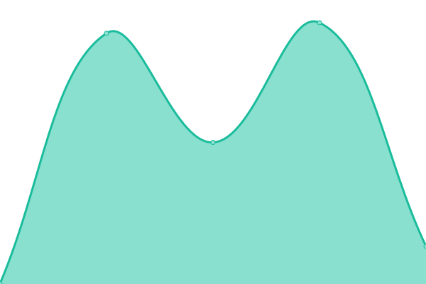

# [📈 Live Status](https://zeit.com.br): <!--live status--> **Todos os serviços estão operando normalmente**

This repository contains the open-source uptime monitor and status page for [Zeit](https://zeit.com.br), powered by [Upptime](https://github.com/upptime/upptime).

With [Upptime](https://upptime.js.org), you can get your own unlimited and free uptime monitor and status page, powered entirely by a GitHub repository. We use [Issues](https://github.com/zeit-ia/status/issues) as incident reports, [Actions](https://github.com/zeit-ia/status/actions) as uptime monitors, and [Pages](https://zeit.com.br) for the status page.

<!--start: status pages-->
<!-- This summary is generated by Upptime (https://github.com/upptime/upptime) -->
<!-- Do not edit this manually, your changes will be overwritten -->
<!-- prettier-ignore -->
| URL | Status | History | Response Time | Uptime |
| --- | ------ | ------- | ------------- | ------ |
|  [Nira](https://nira.zeit.com.br) | Online | [nira.yml](https://github.com/zeit-ia/status/commits/HEAD/history/nira.yml) | 

 690ms
     
 | 

<a href="https://zeit.com.br/history/nira">100.00%</a>
    

|  [Nira (API)](https://nira.zeit.com.br/api/actuator/health) | Online | [nira-api.yml](https://github.com/zeit-ia/status/commits/HEAD/history/nira-api.yml) | 

 145ms
     
 | 

<a href="https://zeit.com.br/history/nira-api">100.00%</a>
    

|  [Zeit Agro](https://agro.zeit.com.br) | Online | [zeit-agro.yml](https://github.com/zeit-ia/status/commits/HEAD/history/zeit-agro.yml) | 

 527ms
     
 | 

<a href="https://zeit.com.br/history/zeit-agro">100.00%</a>
    

<!--end: status pages-->

[**Visit our status website →**](https://zeit.com.br)

## 📄 License

- Powered by: [Upptime](https://github.com/upptime/upptime)
- Code: [MIT](./LICENSE) © [Anand Chowdhary](https://anandchowdhary.com), supported by [Pabio](https://pabio.com)
- Data in the `./history` directory: [Open Database License](https://opendatacommons.org/licenses/odbl/1-0/)
